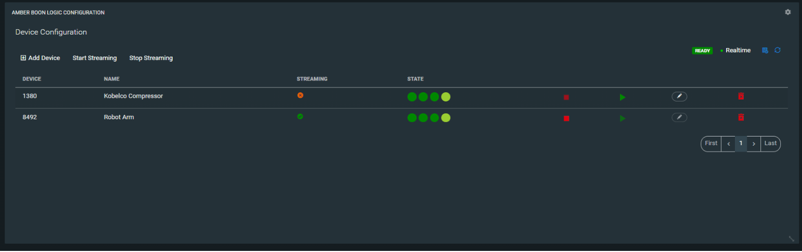
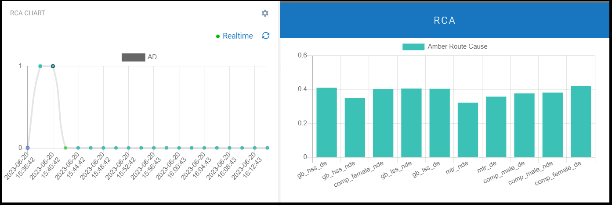
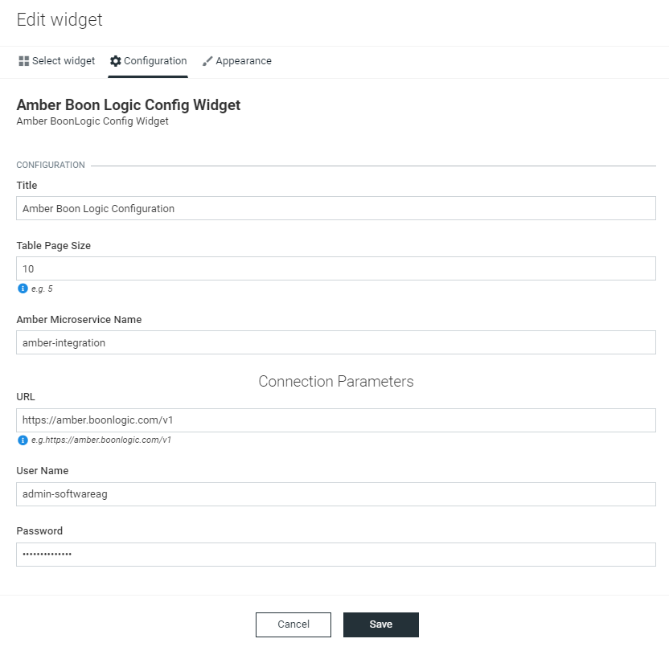
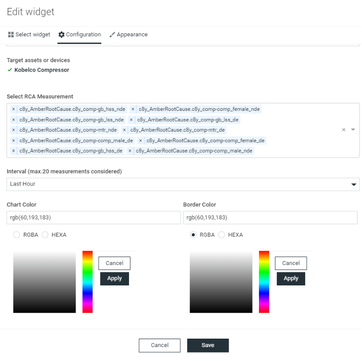

# Amber Boon Logic Device Configuration for Cumulocity

This widget is the Cumulocity module federation plugin created using c8ycli. This plugin can be used in Application Builder or Cockpit.

This widget is used to configure/reconfigure/delete/start - stop stream any device with Amber and is designed to display device model and streaming status on real time basis.

one can see the device modal status and progress level of all the devices which are configured against amber irrespective of data streaming is stopped or not.

# Amber RCA Widget for Cumulocity


## Overview

The Amber RCA widget help you to track real-time RCA values, when ever Anamoly is detected which would be AD>0.
This widget is designed to display the chart for the specific measurement  type - AD. It groups the measurements based on the interval selected (hour/minute basis with real time enabled) and displays the line chart against timeline for each. 

And when ever AD>0 on click one can see the relavent RCA.

## Features

 *  **Support single device:** Based on widget configuration.
 *  **Display realtime measurement update:** whenever a new measurement  is triggered it updates the chart.
 * **Displays the RCA when AD > 0:** Displays the current state based on last event status.

**Dependency:**

Will work only if the respective tenant has amber specific microservice deployed.

## Representation





## Supported Product Versions

###  Amber Device Configuration widget - Cumulocity/Application builder version:

|APPLICATION BUILDER | CUMULOCITY | AMBER RCA  WIDGET |
|--------------------|------------|-------------------|
| 2.x.x              | >= 1016.x.x| 2.x.x             |

### Runtime Widget Deployment?

* This widget support runtime deployment. Download **[Runtime Binary](https://github.com/SoftwareAG/Cumulocity-Amber-Boon-Logic/releases/download/2.1.2/sag-ps-pkg-boonlogic-config-runtime-widget-2.1.2.zip)** and install via Administrations --> Ecosystems --> Applications --> Packages.

### Installation of widget through Appbuilder 

**Prerequisites:**
  
* Git
  
* NodeJS (release builds are currently built with `v14.18.0`)
  
* NPM (Included with NodeJS)
  
**External dependencies:**

```

 "@angular/cdk": "^11.2.13",

 "@angular/core": "~11.1.2",

"@c8y/ngx-components": "1011.0.12",

"@c8y/ng1-modules": "1011.0.12",

"@c8y/style": "1011.0.12",

 Ng2-charts version ^2.4.3

    Installation command:  ```npm install ng2-charts@2.4.3 --save``` 

  - Chart.js version 2.9.3

      Installation command :  ```npm i chart.js@2.9.3 ``` 


```

**Installation Steps For App Builder:**

**Note:** If you are new to App Builder or not yet downloaded/clone app builder code then please follow [App builder documentation(Build Instructions)](https://github.com/SoftwareAG/cumulocity-app-builder) before proceeding further.

1. Grab the Boon Logic Configuration Widget **[Latest Release Binary](https://github.com/SoftwareAG/Cumulocity-Amber-Boon-Logic/releases/download/2.1.2/sag-ps-pkg-boonlogic-config-runtime-widget-2.1.2.zip)**

3. Install the Binary file in app builder.

```
npm i <binary  file  path>/gp-boonlogic-2.0.0.tgz
```
4. Open index.less located at /cumulocity-app-builder/ui-assets/

5. Update index.less file with below theme. Import at first line in file/begining of file(Please ignore this step if it already exist).

```
@import '~@angular/material/prebuilt-themes/indigo-pink.css';
@import '~@c8y/style/main.less';
@import '~@c8y/style/extend.less';
```
6. Import GpBoonlogicModule in app.module.ts and also place the imported Module under `@NgModule`.

```

import {GpBoonlogicModule} from 'gp-boonlogic';

@NgModule({

  imports: [

    GpBoonlogicModule    

      ]

  })

```

7.  Congratulation! Installation is now completed. Now you can run app builder locally or build and deploy it into your tenant.
  
```
//Start App Builder
npm run start
// Build App
npm run build
// Deploy App
npm run deploy
```
## Build Instructions
  
**Note:** It is only necessary to follow these instructions if you are modifying/extending this widget, otherwise see the [Installation Guide](#Installation).
  
**Prerequisites:**
  
* Git
  
* NodeJS (release builds are currently built with `v14.18.0`)
  
* NPM (Included with NodeJS)

**Instructions**

1. Clone the repository:
```
git clone https://github.com/SoftwareAG/Cumulocity-Amber-Boon-Logic.git
```
2. Change directory:

  ```cd cumulocity-amberboonlogic-config-plugin```

3. run npm i command to install all library files specified in source code

  ```npm i ``` 

4. run npm run buildMinor command to create a binary file under dist folder

  ```npm run buildMinor ``` 

5. (Optional) Local development server:
  
  ```npm start```

6. Build the app:

  ```npm run build```

7. Deploy the app:
  ```npm run deploy```

## QuickStart
This guide will teach you how to add widget in your existing or new dashboard.

1. Open the Application Builder from the app switcher (Next to your username in the top right)

2. Click Add application

3. Enter the application details and click Save

4. Select Add dashboard

5. Click Blank Dashboard

6. Enter the dashboard details and click Save

7. Select the dashboard from the navigation

8. Check for your widget and test it out.


Congratulations! BoonLogic Amber setting widget is configured.


## User Guide for boonlogic



1. Takes microservice name and page size as input.
2. Microservice when initially deployed will connect to amber using amber - URL/username/password. Where as on widget level if one wants to forcedly cut down the connection to amber we can just click on disconnect or if the amber credentials are changed then for first time we can connect from widget level and microservice will hold the value.

------------------------------
## User Guide for RCA 



1. Target Assets/Devices - deviceid of interest(need to be pre configured with Amber)
2. Select Device Specific relavent RCA measurements - name of the RCA measurements for which you want chart.
3. Legend - position of legend by defaut is top (not configurable)
4. Interval -  Group AD value for last hour/last minute.
                
One can also select the custom chart color and Border color to beautify the chart, if not default colors will be picked.

------------------------------
  
  
**This widget is provided as-is and without warranty or support. They do not constitute part of the Software AG product suite. Users are free to use, fork and modify them, subject to the license agreement. While Software AG welcomes contributions, we cannot guarantee to include every contribution in the master project.**
  
_____________________
  
For more information you can Ask a Question in the **[TECHcommunity Forums](https://tech.forums.softwareag.com/tags/c/forum/1/Cumulocity-IoT)**.
  
  
You can find additional information in the **[Software AG TECHcommunity](https://tech.forums.softwareag.com/tag/Cumulocity-IoT)**.